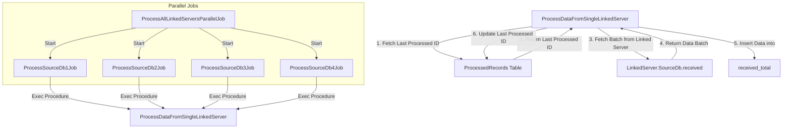

# Benefits and Reasons for the Chosen Approach Compared to the Original

This document outlines the enhancements made to the original approach of processing large datasets from multiple SQL Server databases. The new solution focuses on improving efficiency, scalability, and maintainability. Below is a comparison of the original approach with the new solution, highlighting the benefits and reasons for the chosen approach.

## 1. Tracking Processed Records

### Original Approach:
- **Schema Modification**: Required modifying the schema of source databases to add a status or timestamp column for tracking processed records.
- **Intrusiveness**: Modifications can be intrusive, especially with third-party databases or when schema changes are difficult.

### Chosen Approach (SQLite Tracking):
- **Non-Intrusive**: Uses a separate SQLite database to track the last processed ID for each source database, eliminating the need to modify the source database schema.
- **Portability**: SQLite is lightweight and portable, making it easy to set up and manage without additional infrastructure.
- **Flexibility**: This approach is flexible and can be easily adapted to different source databases without requiring schema changes.

## 2. Batch Processing

### Original Approach:
- **Large Dataset Retrieval**: Might have involved retrieving large datasets in one go, leading to high memory consumption and slow processing times.

### Chosen Approach (Batch Processing):
- **Performance Optimization**: Retrieves and processes data in smaller, manageable batches, reducing memory overhead and improving performance.
- **Scalability**: Scales better with larger datasets, ensuring that the system remains responsive even under heavy loads.

## 3. Handling Multiple Data Sources

### Original Approach:
- **Limited Support**: Might not have efficiently supported multiple data sources, especially in terms of tracking which records were processed from each source.

### Chosen Approach (Support for Multiple Sources):
- **Isolation**: Each source database is processed in isolation, with its own tracking, ensuring consistent data processing across different sources.
- **Parallel Processing Potential**: While the current implementation processes sources sequentially, it can be extended to process multiple sources in parallel, further improving efficiency.

## 4. Error Handling and Data Integrity

### Original Approach:
- **Weak Error Handling**: Error handling might not have been robust, with potential issues in ensuring data integrity, especially during failures.

### Chosen Approach (Transaction Handling and Tracking):
- **Data Integrity**: Uses transactions with `SqlBulkCopy` to ensure that data is either fully inserted or rolled back, maintaining data integrity.
- **Robust Error Handling**: The SQLite tracking mechanism ensures that, even in case of failure, the last processed ID is correctly recorded, preventing reprocessing of the same data.

## 5. Simplicity and Maintainability

### Original Approach:
- **Complex Maintenance**: Might have been more complex to maintain, especially with schema modifications and manual tracking of processed records.

### Chosen Approach (Clean, Modular Design):
- **Clean Codebase**: Designed with simplicity and maintainability in mind, following SOLID principles. It separates concerns into different classes and interfaces, making the code easier to understand, extend, and maintain.
- **Ease of Maintenance**: The use of interfaces and separation of concerns makes it easier to update or extend the system without impacting other parts.

## Process Flow Diagram

## Resources

https://www.milanjovanovic.tech/blog/fast-sql-bulk-inserts-with-csharp-and-ef-core
https://learn.microsoft.com/en-us/dotnet/framework/data/adonet/sql/single-bulk-copy-operations
https://virtual-dba.com/blog/in-memory-tables-sql-server-benefits-limitations-and-how-to-identify/#:~:text=This%20feature%20allows%20faster%20performance,%2C%20update%2C%20and%20delete%20operations
https://learn.microsoft.com/en-us/sql/relational-databases/in-memory-oltp/faster-temp-table-and-table-variable-by-using-memory-optimization?view=sql-server-ver16
