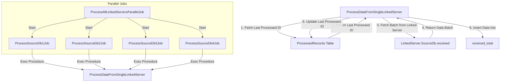

Benefits and Reasons for the Chosen Approach Compared to the Original
The original approach involved processing large datasets from multiple SQL Server databases with the risk of reselecting already processed data. This solution enhances that original approach by introducing several key improvements, primarily focusing on efficiency, scalability, and maintainability. Here’s a comparison of the original approach with the new solution, highlighting the benefits and reasons for the chosen approach:

1. Tracking Processed Records:
Original Approach:
The original approach might require modifying the schema of the source databases to add a status or timestamp column to track processed records.
This modification can be intrusive, especially when working with third-party databases or when the database schema cannot be easily altered.
Chosen Approach (SQLite Tracking):
The new approach uses a separate SQLite database to track the last processed ID for each source database, eliminating the need to modify the source database schema.
Benefits:
Non-Intrusive: No need to change the schema of the source databases, making it easier to implement in environments where schema modifications are restricted.
Portability: SQLite is lightweight and portable, making it easy to set up and manage without additional infrastructure.
Flexibility: The approach is flexible and can be easily adapted to different source databases without requiring schema changes.
2. Batch Processing:
Original Approach:
The original method might have involved retrieving large datasets in one go, which can lead to high memory consumption and slow processing times.
Chosen Approach (Batch Processing):
The new solution retrieves and processes data in smaller, manageable batches.
Benefits:
Performance Optimization: By processing data in batches, the application reduces memory overhead and improves performance, especially with large datasets.
Scalability: The approach scales better with larger datasets, ensuring that the system remains responsive even under heavy loads.
3. Handling Multiple Data Sources:
Original Approach:
The original method might not have efficiently supported multiple data sources, especially in terms of tracking which records were processed from each source.
Chosen Approach (Support for Multiple Sources):
The new approach explicitly supports processing data from multiple source databases, each tracked independently in the SQLite database.
Benefits:
Isolation: Each source database is processed in isolation, with its own tracking, ensuring that data processing remains consistent across different sources.
Parallel Processing Potential: While the current implementation processes sources sequentially, it can be extended to process multiple sources in parallel, further improving efficiency.
4. Error Handling and Data Integrity:
Original Approach:
Error handling might not have been robust, with potential issues in ensuring data integrity, especially during failures.
Chosen Approach (Transaction Handling and Tracking):
The new approach uses transactions with SqlBulkCopy to ensure that data is either fully inserted or rolled back, maintaining data integrity.
The SQLite tracking mechanism ensures that, even in case of failure, the last processed ID is correctly recorded, preventing reprocessing of the same data.
Benefits:
Data Integrity: Ensures that data is consistently processed without duplicates or missing records.
Robust Error Handling: In the event of an error, the system can recover gracefully, without risking data corruption or reprocessing.
5. Simplicity and Maintainability:
Original Approach:
The original approach might have been more complex to maintain, especially with schema modifications and manual tracking of processed records.
Chosen Approach (Clean, Modular Design):
The new solution is designed with simplicity and maintainability in mind, following the SOLID principles. It separates concerns into different classes and interfaces, making the code easier to understand, extend, and maintain.
Benefits:
Clean Codebase: The modular design ensures that each part of the system has a single responsibility, making it easier to test, debug, and modify.
Ease of Maintenance: The use of interfaces and separation of concerns makes it easier to update or extend the system without impacting other parts.

