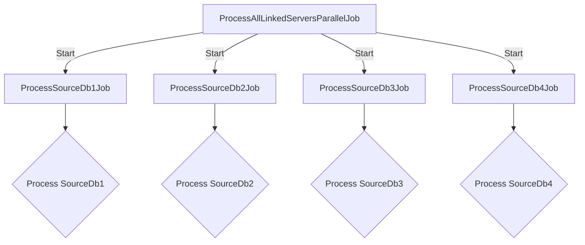

Use a Master Job with Multiple Sub-Jobs
Create a master SQL Server Agent job that starts multiple sub-jobs, each responsible for processing a different source database. This method allows you to manage and trigger parallel execution within a single parent job.

Create Sub-Jobs: Create the four jobs as described in Method 1.
Create a Master Job:
This job will have steps that start the sub-jobs using sp_start_job.

`EXEC msdb.dbo.sp_start_job N'ProcessSourceDb1Job';
EXEC msdb.dbo.sp_start_job N'ProcessSourceDb2Job';
EXEC msdb.dbo.sp_start_job N'ProcessSourceDb3Job';
EXEC msdb.dbo.sp_start_job N'ProcessSourceDb4Job';
`

Benefits of Parallel Execution Setup
1. By running the steps in parallel, you can significantly reduce the total time required to process data from all sources.
2. This setup easily scales with the number of databases you need to process. You can add more jobs for additional databases without over-complicating the process.
3. If one job fails, it does not impact the others. This isolation can be particularly useful for troubleshooting.

Monitoring and Logging
Job History: Monitor the job history in SQL Server Agent to ensure all jobs are executing as expected. You can review logs for any failures or issues.

